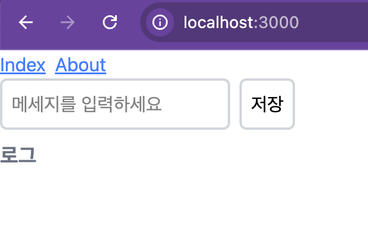
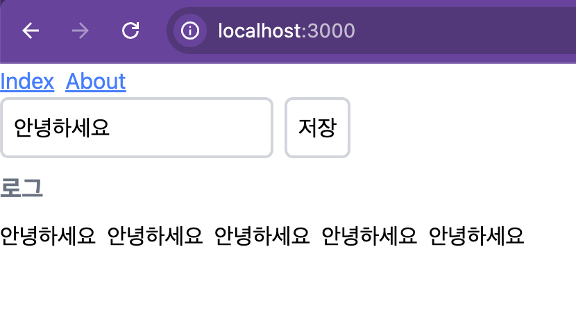
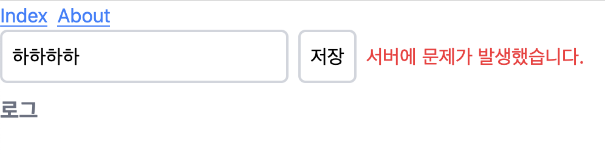
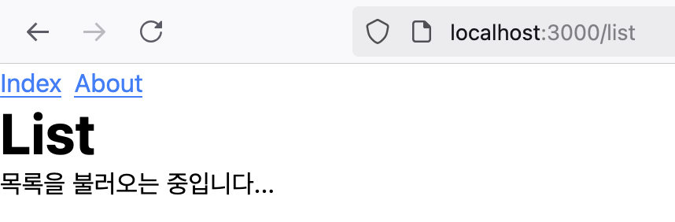
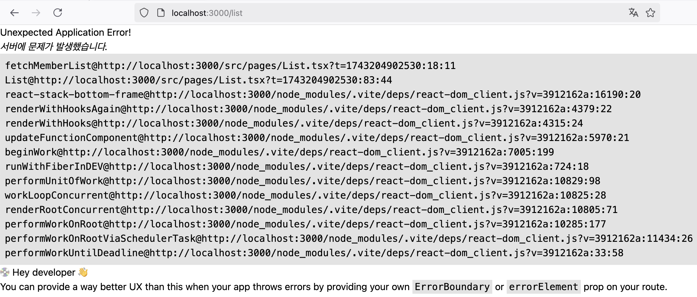
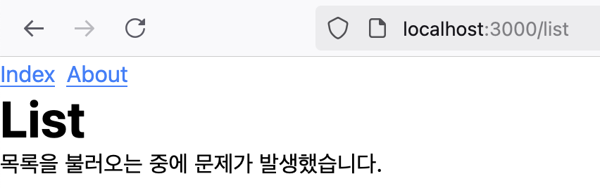
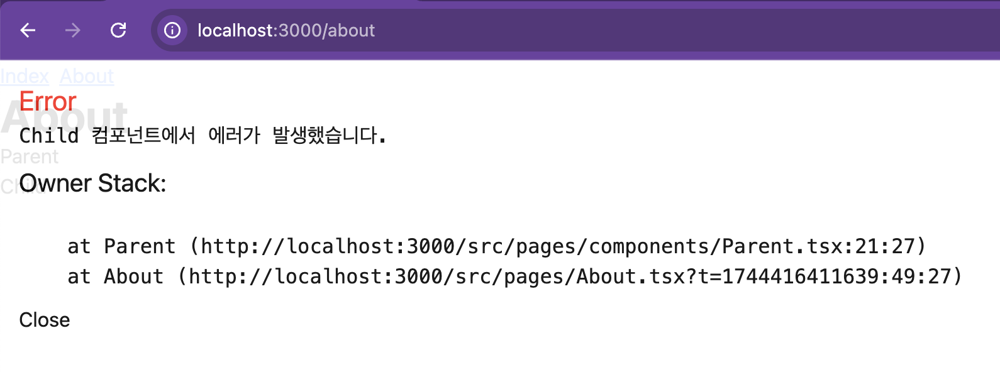

# React 19 알아보기

## 1. 프로젝트 세팅하기

### 1.1 vite 프로젝트 세팅

우선 vite를 이용해서 react 프로젝트를 설정합니다.

```bash
> npm create vite@latest react-19
Need to install the following packages:
create-vite@6.3.1
Ok to proceed? (y) y


> npx
> create-vite react-19

│
◇  Select a framework:
│  React
│
◇  Select a variant:
│  TypeScript + SWC
│
◇  Scaffolding project in /Users/onlifecoding/src/studies/react-19...
│
└  Done. Now run:

  cd react-19
  npm install
  npm run dev

> cd react-19
> npm i
```

이렇게 프로젝트를 설정하고 에디터를 통해 프로젝트를 열어보면, 다음과 같이 react 19 프로젝트가 설정된 것을 확인할 수 있습니다.

```json
{
  ...
  "dependencies": {
    "react": "^19.0.0",
    "react-dom": "^19.0.0"
  },
  "devDependencies": {
    ...
    "@types/react": "^19.0.10",
    "@types/react-dom": "^19.0.4",
    ...
  }
}
```

### 1.2 tailwindcss 설정

tailwindcss를 설치합니다.

```bash
> npm i tailwindcss @tailwindcss/vite
```

`vite.config.ts` 파일에 tailwindcss를 설정합니다.

```ts
import { defineConfig } from "vite";
import react from "@vitejs/plugin-react-swc";
import tailwindcss from "@tailwindcss/vite";

// https://vite.dev/config/
export default defineConfig({
  plugins: [react(), tailwindcss()],
  server: {
    port: 3000,
  },
});
```

`src/index.css` 파일의 최상단에 다음과 같이 작성합니다.

```css
@import "tailwindcss";
```

### 1.3 react-router-dom 및 기본 라우팅 설정

페이지간의 이동을 위해 react-router-dom을 설치합니다.

```bash
> npm install react-router-dom
```

그리고 `src/Router.tsx` 파일을 생성하고 다음과 같이 코드를 작성합니다.

```tsx
import { lazy } from "react";
import { createBrowserRouter, Outlet } from "react-router-dom";

const Index = lazy(() => import("./pages/Index"));
const About = lazy(() => import("./pages/About"));

// 루트 레이아웃 컴포넌트
const RootLayout = () => {
  return (
    <div className="h-screen w-full">
      <Outlet />
    </div>
  );
};

export const router = createBrowserRouter([
  {
    path: "/",
    element: <RootLayout />,
    children: [
      {
        index: true,
        element: <Index />,
      },
      {
        path: "/about",
        element: <About />,
      },
    ],
  },
]);
```

라우팅 확인을 위해 `src/pages/Index.tsx` 파일을 다음과 같이 작성합니다.

```tsx
import { Link } from "react-router-dom";

const Index = () => {
  return (
    <div className="h-screen w-full flex flex-col">
      <div className="w-full flex items-center gap-2 text-blue-500 underline">
        <Link to="/">Index</Link>
        <Link to="/about">About</Link>
      </div>
      <div className="text-4xl font-bold">Index</div>
    </div>
  );
};

export default Index;
```

이어서 `src/pages/About.tsx` 파일을 다음과 같이 작성합니다.

```tsx
import { Link } from "react-router-dom";

const About = () => {
  return (
    <div className="h-screen w-full flex flex-col">
      <div className="w-full flex items-center gap-2 text-blue-500 underline">
        <Link to="/">Index</Link>
        <Link to="/about">About</Link>
      </div>
      <div className="text-4xl font-bold">About</div>
    </div>
  );
};
export default About;
```

마지막으로 라우팅이 동작하도록 `src/App.tsx` 파일을 다음과 같이 작성합니다.

```tsx
import { Suspense } from "react";
import { RouterProvider } from "react-router-dom";
import { router } from "./Router";

function App() {
  return (
    <Suspense fallback={<div>Loading...</div>}>
      <RouterProvider router={router} />
    </Suspense>
  );
}

export default App;
```

이제 프로젝트를 실행하고 라우팅이 동작하는 것을 확인할 수 있습니다.

```bash
> npm run dev
```

## 2. React 19 알아보기

### 2.1 Actions

React에서는 데이터를 작성하고 저장하거나 수정하는 일이 빈번하게 발생합니다. 사실 웹 페이지라는 게 데이터를 저장하고, 표시하고, 수정하고, 삭제하는 것이 전부이기 때문입니다. 이렇게 데이터를 다루는 과정에서 무언가 상태 값이 변경되겠죠?(ex: 서버에 데이터를 전송하고 처리되기 기다릴 때, 요청 상태는 요청중 -> 요청 완료 또는 요청중 -> 요청 실패 등으로 변경될 겁니다!) 이렇게 상태가 변경되는 걸 상태 전이(transition)이라고 합니다. 그리고 [공식 문서](https://react.dev/blog/2024/12/05/react-19#by-convention-functions-that-use-async-transitions-are-called-actions)에 따르면, 비동기 상태 전이(async transition)을 사용하는 함수를 Action이라고 정의하고 있습니다.

#### 2.1.1 useTransition

예시를 하나 들어볼까요? 서버에 데이터를 전송하는 경우를 생각해보죠. 서버와의 통신 작업을 진행할 때 중요한 점은, 사용자가 실수로 저장 버튼을 두번 클릭하는 걸 방지할 수 있어야 합니다. 만약 이런 처리가 제대로 되지 않는다면, 데이터가 중복으로 저장되어 문제가 발생할 수 있습니다. 예시를 위해서 `src/pages/Index.tsx` 파일을 다음과 같이 작성합니다.

```tsx
import { useState } from "react";
import { Link } from "react-router-dom";

const wait = (ms: number) => new Promise((resolve) => setTimeout(resolve, ms));

const Index = () => {
  const [message, setMessage] = useState("");
  const [log, setLog] = useState<string[]>([]);

  const handleSave = async () => {
    await wait(2000); // 서버와의 통신을 흉내내기 위해 2초 대기
    setLog((prev: string[]) => [...prev, message]);
  };

  return (
    <div className="h-screen w-full flex flex-col">
      <div className="w-full flex items-center gap-2 text-blue-500 underline">
        <Link to="/">Index</Link>
        <Link to="/about">About</Link>
      </div>
      <div className="flex items-center gap-2">
        <input
          type="text"
          placeholder="메세지를 입력하세요"
          value={message}
          onChange={(e) => setMessage(e.target.value)}
        />
        <button onClick={handleSave}>저장</button>
      </div>
      <div className="flex items-center gap-2">
        {log.map((item, index) => (
          <div key={index}>{item}</div>
        ))}
      </div>
    </div>
  );
};

export default Index;
```

완성된 페이지는 다음과 같습니다.

<p align="center"></p>

메세지를 입력할 수 있는 입력 필드와 저장 버튼을 표시하고, 저장 버튼을 클릭하면 메세지를 서버에 저장하는 기능을 구현했습니다. 그리고 서버에 저장하는 걸 흉내내기 위해서 저장 버튼을 누르면 2초 대기 후 저장된 메세지를 표시하도록 했습니다.

이 페이지에서 메세지를 입력하고, 저장 버튼을 누르면 2초 후에 저장된 메세지가 로그에 표시되는 걸 확인할 수 있습니다. 그런데 저장 버튼을 마구 누르면 어떻게 될까요?

<p align="center"></p>

서버에 저장하는 동안 입력을 방지하는 작업을 하지 않았기 때문에 누르는 만큼 중복되어 저장되는 걸 볼 수 있습니다. 그러면 입력을 방지하기 위한 장치를 추가해보겠습니다.

```tsx
...
const Index = () => {
  ...
  const [isSaving, setIsSaving] = useState(false);

  const handleSave = async () => {
    setIsSaving(true);
    await wait(2000); // 서버와의 통신을 흉내내기 위해 2초 대기
    setLog((prev: string[]) => [...prev, message]);
    setIsSaving(false);
  };

  return (
    <div className="h-screen w-full flex flex-col gp">
      ...
      <div className="flex flex-col gap-2">
        <div className="flex items-center gap-2">
          ...
          <button
            className="border-2 border-gray-300 rounded-md p-2 disabled:opacity-50 disabled:cursor-not-allowed"
            onClick={handleSave}
            disabled={isSaving}
          >
            저장
          </button>
        </div>
        ...
      </div>
    </div>
  );
};

export default Index;
```

데이터를 저장하는 중인지 알 수 있는 상태 `isSaving`을 추가했습니다. 그리고 저장 버튼을 누르면 이 상태를 `true`로 변경하고, 서버와의 통신이 끝나면 `false`로 변경합니다. 이렇게 하면 저장 버튼이 눌리지 않은 상태에서는 비활성화되어 입력을 방지할 수 있습니다. 그리고 사용자에게 버튼을 누를 수 없다는 알림을 위해 `disabled` 속성과 스타일을 추가했습니다.

이제 저장 버튼을 누르면 중복으로 저장되는 걸 막을 수 있습니다. React 19에서는 이런 작업을 쉽게 할 수 있도록 `useTransition` 훅을 제공합니다. 이 훅은 서버에 데이터를 저장하는 등의 비동기 작업이 시작될 때 `isPending` 상태를 `true`로 변경하고, 끝나면 `false`로 변경합니다. 위 예제를 다음과 같이 수정할 수 있습니다.

```tsx
import { useState, useTransition } from "react";
import { Link } from "react-router-dom";

const wait = (ms: number) => new Promise((resolve) => setTimeout(resolve, ms));

const Index = () => {
  const [message, setMessage] = useState("");
  const [log, setLog] = useState<string[]>([]);
  const [isPending, startTransition] = useTransition();

  const handleSave = async () => {
    startTransition(async () => {
      await wait(2000); // 서버와의 통신을 흉내내기 위해 2초 대기
      setLog((prev: string[]) => [...prev, message]);
    });
  };

  return (
    <div className="h-screen w-full flex flex-col gp">
      ...
      <div className="flex flex-col gap-2">
        <div className="flex items-center gap-2">
          ...
          <button
            className="border-2 border-gray-300 rounded-md p-2 disabled:opacity-50 disabled:cursor-not-allowed"
            onClick={handleSave}
            disabled={isPending}
          >
            저장
          </button>
        </div>
        ...
      </div>
    </div>
  );
};

export default Index;
```

`isSaving`과 같은 별도의 상태를 사용하지 않아도 되고, 사용자가 직업 `setIsSaving(true)`, `setIsSaving(false)`를 호출해야 할 필요도 없어졌습니다. `startTransition` 함수를 사용하면, 호출이 시작될 때와 종료될 때 `useTransition` 훅이 자동으로 상태를 관리해줍니다.

> useTransition은 React 18에서도 사용할 수 있습니다!

#### 2.1.2 useActionState

만약 데이터를 전송하던 중에 오류가 발생한다면 어떻게 될까요? 사용자에게 뭔가 오류가 발생했다는 사실을 알려줘야 합니다. 그렇지 않으면, 사용자는 뭐가 안되는지도 모르면서 계속 여기저기 클릭하다가 결국 사용을 포기하겠죠!

```typescript
import { useState, useTransition } from "react";
import { Link } from "react-router-dom";

const wait = (ms: number) => new Promise((resolve) => setTimeout(resolve, ms));

/**
 * 서버에 데이터를 전송하는 함수, 일부러 오류를 발생시키기 위해 예외를 던집니다.
 */
const submitMessage = async (message: string) => {
  console.log(`submitMessage: ${message}`);
  await wait(2000); // 서버와의 통신을 흉내내기 위해 2초 대기
  throw new Error("서버에 문제가 발생했습니다.");
};

const Index = () => {
  const [message, setMessage] = useState("");
  const [log, setLog] = useState<string[]>([]);
  const [isPending, startTransition] = useTransition();
  const [error, setError] = useState<string | null>(null);

  const handleSave = async () => {
    setError(null);

    startTransition(async () => {
      try {
        await submitMessage(message);

        setLog((prev: string[]) => [...prev, message]);
      } catch (error: unknown) {
        setError(
          error instanceof Error
            ? error.message
            : "알 수 없는 오류가 발생했습니다."
        );
      }
    });
  };

  return (
    <div className="h-screen w-full flex flex-col gp">
      <div className="w-full flex items-center gap-2 text-blue-500 underline">
        <Link to="/">Index</Link>
        <Link to="/about">About</Link>
      </div>
      <div className="flex flex-col gap-2">
        <div className="flex items-center gap-2">
          <input
            className="border-2 border-gray-300 rounded-md p-2"
            type="text"
            placeholder="메세지를 입력하세요"
            value={message}
            onChange={(e) => setMessage(e.target.value)}
          />
          <button
            className="border-2 border-gray-300 rounded-md p-2 disabled:opacity-50 disabled:cursor-not-allowed"
            onClick={handleSave}
            disabled={isPending}
          >
            저장
          </button>
          {error && <p className="text-red-500">{error}</p>}
        </div>
        <div className="flex flex-col gap-2">
          <p className="text-lg font-bold text-gray-500">로그</p>
          <div className="flex items-center gap-2">
            {log.map((item, index) => (
              <div key={index}>{item}</div>
            ))}
          </div>
        </div>
      </div>
    </div>
  );
};

export default Index;
```

저장 버튼을 눌렀을 때, 서버에 메세지를 전송하는 걸 흉내내기 위해 `submitMessage` 함수를 추가했습니다. 그리고 서버에서 뭔가 오류가 발생하는 상황을 만들기 위해 일부러 예외를 던지도록 했습니다.

이제 저장 버튼을 누르면 2초 대기 후 에러 메세지가 표시되는 걸 볼 수 있습니다.

<p align="center"></p>

React 19에 추가된 `useActionState` 훅을 사용하면, 이런 폼 전송 작업의 상태와 에러 처리를 더 쉽게 할 수 있습니다.

```typescript
import { useActionState, useState } from "react";
import { Link } from "react-router-dom";

const wait = (ms: number) => new Promise((resolve) => setTimeout(resolve, ms));

interface submitMessageResult {
  error: string | null;
}

/**
 * 서버에 데이터를 전송하는 함수, 일부러 오류를 발생시키기 위해 예외를 던집니다.
 */
const submitMessage = async (message: string) => {
  console.log(`submitMessage: ${message}`);
  await wait(2000); // 서버와의 통신을 흉내내기 위해 2초 대기
  throw new Error("서버에 문제가 발생했습니다.");
};

const Index = () => {
  const [message, setMessage] = useState("");
  const [log, setLog] = useState<string[]>([]);
  /**
   * 각각 Action의 결과, 폼의 값을 전송할 Action, Action의 진행 상태를 나타냅니다.
   *
   * 이 예제에서는 결과 값으로 오류 메세지만 리턴합니다.
   */
  const [result, submitAction, isPending] = useActionState(
    async (
      prevState: submitMessageResult,
      formData: FormData
    ): Promise<submitMessageResult> => {
      const message = formData.get("message") as string;

      if (prevState) {
        console.log(`이전 상태 값: ${JSON.stringify(prevState)}`);
      }

      try {
        await submitMessage(message);

        setLog((prev: string[]) => [...prev, message]);

        return { error: null }; // Action의 결과를 리턴합니다. 오류가 없었으므로 null을 리턴합니다.
      } catch (error: unknown) {
        const errorMessage =
          error instanceof Error
            ? error.message
            : "알 수 없는 오류가 발생했습니다.";
        return { error: errorMessage }; // 오류가 있었으므로 오류 메세지를 리턴합니다.
      }
    },
    { error: null } // 초기 상태는 null입니다.
  );

  return (
    <div className="h-screen w-full flex flex-col gp">
      <div className="w-full flex items-center gap-2 text-blue-500 underline">
        <Link to="/">Index</Link>
        <Link to="/about">About</Link>
      </div>
      <div className="flex flex-col gap-2">
        <form action={submitAction} className="flex items-center gap-2">
          <input
            name="message"
            className="border-2 border-gray-300 rounded-md p-2"
            type="text"
            placeholder="메세지를 입력하세요"
            value={message}
            onChange={(e) => setMessage(e.target.value)}
          />
          <button
            className="border-2 border-gray-300 rounded-md p-2 disabled:opacity-50 disabled:cursor-not-allowed"
            type="submit"
            disabled={isPending}
          >
            저장
          </button>
          {!isPending && result.error && (
            <p className="text-red-500">{result.error}</p>
          )}
        </form>
        <div className="flex flex-col gap-2">
          <p className="text-lg font-bold text-gray-500">로그</p>
          <div className="flex items-center gap-2">
            {log.map((item, index) => (
              <div key={index}>{item}</div>
            ))}
          </div>
        </div>
      </div>
    </div>
  );
};

export default Index;
```

직접 `setError`를 통해 오류 메세지를 설정할 필요 없이 useActionState 훅을 통해 Action의 결과와 진행 상태를 관리할 수 있습니다. 그리고 이전 상태까지도 접근할 수 있어서, 뭔가 이전 상태에 따른 처리를 할 수도 있습니다.

#### 2.1.3 use

아마도 웹에서 가장 빈번한 작업을 서버에서 비동기(async)로 데이터를 조회해서 목록을 출력하는 작업일겁니다. 그런 작업을 하나 추가해볼까요? `pages/List.tsx` 파일을 추가하고 다음과 같이 작성합니다.

> 단순한 구현을 위해 코드 중복은 무시하겠습니다!

```tsx
import { Suspense } from "react";
import { Link } from "react-router-dom";
import MemberList from "./components/MemberList";

const wait = (ms: number) => new Promise((resolve) => setTimeout(resolve, ms));

/**
 * 멤버 목록을 조회하는 함수
 * @returns 멤버 목록
 */
const fetchMemberList = async () => {
  await wait(2000); // 서버와의 통신을 흉내내기 위해 2초 대기

  return [
    { id: 1, name: "John" },
    { id: 2, name: "Jane" },
    { id: 3, name: "Jim" },
  ];
};

const List = () => {
  return (
    <div className="h-screen w-full flex flex-col">
      <div className="w-full flex items-center gap-2 text-blue-500 underline">
        <Link to="/">Index</Link>
        <Link to="/about">About</Link>
      </div>
      <div className="text-4xl font-bold">List</div>
      <div className="flex flex-col gap-2">
        {/* 비동기 처리를 위해 Suspense를 사용 */}
        <Suspense fallback={<div>목록을 불러오는 중입니다...</div>}>
          {/* 멤버 목록을 조회하는 함수의 Promise를 넘겨줍니다. */}
          <MemberList memberListPromise={fetchMemberList()} />
        </Suspense>
      </div>
    </div>
  );
};

export default List;
```

`MemberList` 컴포넌트에 멤버 목록을 조회하는 함수의 결과인 Promise를 넘겨주고 있습니다.
이제 `pages/components/MemberList.tsx` 파일을 추가하고 다음과 같이 작성합니다.

```tsx
import { use } from "react";

interface MemberListProps {
  memberListPromise: Promise<
    {
      id: number;
      name: string;
    }[]
  >;
}

/**
 * 멤버 목록을 조회하는 컴포넌트
 * @param memberListPromise 멤버 목록을 조회하는 Promise
 * @returns 멤버 목록
 */
const MemberList = ({ memberListPromise }: MemberListProps) => {
  // Promise의 결과가 resolve될 때까지 기다립니다.
  const memberList = use(memberListPromise);

  return (
    <ul>
      {memberList.map((member) => (
        <li key={member.id}>{`${member.id} - ${member.name}`}</li>
      ))}
    </ul>
  );
};

export default MemberList;
```

Promise를 받아서 `use` 훅으로 넘겨줍니다. `use` 훅은 Promise 결과가 나올 때 까지(resolve 또는 reject) 기다리고, 그 결과를 반환합니다. 결과를 받아서 `li` 요소를 생성합니다.

마지막으로 `Router.tsx` 파일에 다음과 같이 라우팅을 추가합니다.

```tsx
import { lazy } from "react";
import { createBrowserRouter, Outlet } from "react-router-dom";

const Index = lazy(() => import("./pages/Index"));
const About = lazy(() => import("./pages/About"));
const List = lazy(() => import("./pages/List"));

// 루트 레이아웃 컴포넌트
// eslint-disable-next-line react-refresh/only-export-components
const RootLayout = () => {
  return (
    <div className="h-screen w-full">
      <Outlet />
    </div>
  );
};

export const router = createBrowserRouter([
  {
    path: "/",
    element: <RootLayout />,
    children: [
      {
        index: true,
        element: <Index />,
      },
      {
        path: "/about",
        element: <About />,
      },
      {
        path: "/list",
        element: <List />,
      },
    ],
  },
]);
```

이제 브라우저에서 `http://localhost:3000/list` 주소로 이동하면, 서버의 응답을 기다리는 동안 `Suspense` 컴포넌트의 `fallback` 속성으로 설정한 내용이 표시되다가 서버의 응답이 오면 멤버 목록을 조회하는 작업이 진행되는 걸 볼 수 있습니다.

<p align="center"></p>

만약 서버에서 데이터를 조회하는 작업이 실패한다면, 그러니까 Promise가 reject 된다면 어떻게 될까요? `fetchMemberList` 함수에서 일부러 오류가 발생하도록 수정해볼까요?

```tsx
/**
 * 멤버 목록을 조회하는 함수
 * @returns 멤버 목록
 */
const fetchMemberList = async () => {
  throw new Error("서버에 문제가 발생했습니다.");
  await wait(2000); // 서버와의 통신을 흉내내기 위해 2초 대기

  return [
    { id: 1, name: "John" },
    { id: 2, name: "Jane" },
    { id: 3, name: "Jim" },
  ];
};
```

페이지를 새로고침 해보면, 컴포넌트 내용 대신에 오류 메세지가 표시됩니다!

<p align="center"></p>

이럴 때는 Promise에 catch 핸들러를 추가할 수도 있지만, `ErrorBoundary`를 사용해서 오류를 사용자에게 친화적인 메시지로 표시할 수 있습니다. 우선, `react-error-boundary` 패키지를 설치합니다.

```bash
> npm install react-error-boundary
```

그리고 `src/pages/List.tsx` 파일의 `Suspense` 컴포넌트를 `ErrorBoundary` 컴포넌트로 감싸줍니다.

```tsx
import { Suspense } from "react";
import { Link } from "react-router-dom";
import MemberList from "./components/MemberList";
import { ErrorBoundary } from "react-error-boundary";

const wait = (ms: number) => new Promise((resolve) => setTimeout(resolve, ms));

/**
 * 멤버 목록을 조회하는 함수
 * @returns 멤버 목록
 */
const fetchMemberList = async () => {
  throw new Error("서버에 문제가 발생했습니다.");
  await wait(2000); // 서버와의 통신을 흉내내기 위해 2초 대기

  return [
    { id: 1, name: "John" },
    { id: 2, name: "Jane" },
    { id: 3, name: "Jim" },
  ];
};

const List = () => {
  return (
    <div className="h-screen w-full flex flex-col">
      <div className="w-full flex items-center gap-2 text-blue-500 underline">
        <Link to="/">Index</Link>
        <Link to="/about">About</Link>
      </div>
      <div className="text-4xl font-bold">List</div>
      <div className="flex flex-col gap-2">
        <ErrorBoundary
          fallback={<div>목록을 불러오는 중에 문제가 발생했습니다.</div>}
        >
          {/* 비동기 처리를 위해 Suspense를 사용 */}
          <Suspense fallback={<div>목록을 불러오는 중입니다...</div>}>
            {/* 멤버 목록을 조회하는 함수의 Promise를 넘겨줍니다. */}
            <MemberList memberListPromise={fetchMemberList()} />
          </Suspense>
        </ErrorBoundary>
      </div>
    </div>
  );
};

export default List;
```

이렇게 하면 데이터를 조회하는 작업이 실패했을 때, 사용자에게 친화적인 메시지를 표시할 수 있습니다.

<p align="center"></p>

# React 19.1 업이데트하기

다음 명령을 통해 설치된 패키지의 현재 버전과 최신 버전을 확인합니다.

```
> npm outdated
Package                   Current   Wanted  Latest  Location                               Depended by
@eslint/js                 9.22.0   9.24.0  9.24.0  node_modules/@eslint/js                react-19
@tailwindcss/vite          4.0.14    4.1.3   4.1.3  node_modules/@tailwindcss/vite         react-19
@types/react              19.0.10   19.1.1  19.1.1  node_modules/@types/react              react-19
@types/react-dom           19.0.4   19.1.2  19.1.2  node_modules/@types/react-dom          react-19
@vitejs/plugin-react-swc    3.8.0    3.8.1   3.8.1  node_modules/@vitejs/plugin-react-swc  react-19
eslint                     9.22.0   9.24.0  9.24.0  node_modules/eslint                    react-19
globals                   15.15.0  15.15.0  16.0.0  node_modules/globals                   react-19
react                      19.0.0   19.1.0  19.1.0  node_modules/react                     react-19
react-dom                  19.0.0   19.1.0  19.1.0  node_modules/react-dom                 react-19
react-router-dom            7.3.0    7.5.0   7.5.0  node_modules/react-router-dom          react-19
tailwindcss                4.0.14    4.1.3   4.1.3  node_modules/tailwindcss               react-19
typescript                  5.7.3    5.7.3   5.8.3  node_modules/typescript                react-19
typescript-eslint          8.26.1   8.29.1  8.29.1  node_modules/typescript-eslint         react-19
vite                        6.2.2    6.2.6   6.2.6  node_modules/vite                      react-19
```

위 내용 중 `Current`, `Wanted`, `Latest` 열은 다음과 같은 의미를 가집니다.

- Current: 현재 설치된 버전
- Wanted: package.json 파일에 설정된 버전 범위를 만족하는 최신 버전(ex: "~5.7.2"는 5.7.2 <= 패키지 버전 < 5.8.0, "^6.2.0"은 6.2.0 <= 패키지 버전 < 7.0.0)
- Latest: 최신 버전

자 그러면, 모든 패키지를 `Wanted` 버전으로 업데이트 하겠습니다.

```bash
> npm update
```

이제 다시 패키지 버전을 확인해보면, 다음과 같이 모든 패키지가 최신 버전으로 업데이트 된 것을 확인할 수 있습니다.

## Owner Stacks

React 19.1 버전에서 추가된 Owner Stacks는 컴포넌트의 오류가 발생했을 때, 오류가 발생한 컴포넌트의 계층 구조를 표시해줍니다. 그래서 실제로 어떤 컴포넌트에서 오류가 발생했고, 그 컴포넌트는 어떤 컴포넌트가 렌더링한 건지 확인할 수 있어 디버깅할 때 유용합니다.

[공식 문서](https://react.dev/reference/react/captureOwnerStack)를 참조하여 다음과 같은 예제를 작성해보겠습니다.

우선, 무언가 에러가 발생했을 때 화면에 오버레이를 표시할 수 있도록 `index.html` 파일을 수정합니다.

```html
<!doctype html>
<html lang="en">
  <head>
    <meta charset="UTF-8" />
    <link rel="icon" type="image/svg+xml" href="/vite.svg" />
    <meta name="viewport" content="width=device-width, initial-scale=1.0" />
    <title>Vite + React + TS</title>
  </head>
  <body>
    <!--
  Error dialog in raw HTML
  since an error in the React app may crash.
-->
<div id="error-dialog" class="hidden">
  <h1 id="error-title" class="text-red">Error</h1>
  <p class="">
    <pre id="error-body"></pre>
  </p>
  <div class="mb-10"></div>
  <h2 class="">Owner Stack:</h2>
  <pre id="error-owner-stack" class="nowrap"></pre>
  <button
    id="error-close"
    class="mt-10"
    onclick="document.getElementById('error-dialog').classList.add('hidden')"
  >
    Close
  </button>
</div>
    <div id="root"></div>
    <script type="module" src="/src/main.tsx"></script>
  </body>
</html>
```

그리고 이 오버레이의 스타일을 `src/index.css` 파일에 추가합니다.

```css
#error-dialog {
  position: absolute;
  top: 0;
  right: 0;
  bottom: 0;
  left: 0;
  background-color: white;
  padding: 15px;
  opacity: 0.9;
  text-wrap: wrap;
  overflow: scroll;
}

#error-dialog h1 {
  margin-top: 0;
  font-size: 22px;
}

#error-dialog h2 {
  margin-top: 0;
  font-size: 20px;
}

#error-dialog .text-red {
  color: red;
}

#error-dialog .mb-20 {
  margin-bottom: 20px;
}

#error-dialog .mb-10 {
  margin-bottom: 10px;
}

#error-dialog .mb-0 {
  margin-bottom: 0;
}

#error-dialog .mt-10 {
  margin-top: 10px;
}

#error-dialog pre {
  text-wrap: wrap;
}

#error-dialog pre.nowrap {
  text-wrap: nowrap;
}

#error-dialog .hidden {
  display: none;
}
```

다음으로 오버레이에 에러 메세지와 `Owner Stack`을 표시할 수 있도록 하는 유틸 함수를 `src/utils/errorOverlay.ts` 파일에 추가합니다.

```tsx
export const onConsoleError = ({
  consoleMessage,
  ownerStack,
}: {
  consoleMessage: string;
  ownerStack: string | null;
}) => {
  const errorDialog = document.getElementById("error-dialog");
  const errorBody = document.getElementById("error-body");
  const errorOwnerStack = document.getElementById("error-owner-stack");

  if (errorBody) {
    // Display console.error() message
    errorBody.innerText = consoleMessage;
  }

  if (errorOwnerStack) {
    // Display owner stack
    errorOwnerStack.innerText = ownerStack ?? "-no owner stack-";
  }

  if (errorDialog) {
    // Show the dialog
    errorDialog.classList.remove("hidden");
  }
};
```

이제 마지막으로 `src/main.tsx` 파일에 `console.error` 함수를 재정의하여 `console.error` 함수가 호출될 때 오버레이에 에러 메세지와 `Owner Stack`을 표시할 수 있도록 합니다.

```tsx
import { captureOwnerStack, StrictMode } from "react";
import { createRoot } from "react-dom/client";
import "./index.css";
import App from "./App.tsx";
import { onConsoleError } from "./utils/errorOverlay.ts";

// 원래의 console.error 함수를 저장
const originalConsoleError = console.error;

// 재정의된 console.error 함수
console.error = function patchedConsoleError(...args) {
  // 원래의 console.error 함수를 호출
  originalConsoleError.apply(console, args);
  // Owner Stack을 캡쳐
  const ownerStack = captureOwnerStack();
  // 오버레이에 에러 메세지와 Owner Stack을 표시
  onConsoleError({
    consoleMessage: args[0],
    ownerStack,
  });
};

createRoot(document.getElementById("root")!).render(
  <StrictMode>
    <App />
  </StrictMode>
);
```

이제 브라우저에서 무언가 에러가 발생했을 때 오버레이에 에러 메세지와 `Owner Stack`을 표시할 수 있습니다. 그러면 간단하게 테스트를 해볼까요?

다음과 같이 `src/pages/components/Parent.tsx`와 `src/pages/components/Child.tsx` 파일을 추가합니다.

```tsx
const Child = () => {
  console.error("Child 컴포넌트에서 에러가 발생했습니다.");

  return <div>Child</div>;
};

export default Child;
```

```tsx
import Child from "./Child";

const Parent = () => {
  return (
    <>
      <div>Parent</div>
      <Child />
    </>
  );
};

export default Parent;
```

그리고 `src/pages/About.tsx` 파일에 `Parent` 컴포넌트를 추가합니다.

```tsx
import { Link } from "react-router-dom";
import Parent from "./components/Parent";

const About = () => {
  return (
    <div className="h-screen w-full flex flex-col">
      <div className="w-full flex items-center gap-2 text-blue-500 underline">
        <Link to="/">Index</Link>
        <Link to="/about">About</Link>
      </div>
      <div className="text-4xl font-bold">About</div>
      <Parent />
    </div>
  );
};
export default About;
```

이제 브라우저에서 `About` 페이지로 이동해서 에러를 확인해볼까요?

<p align="center"></p>

오버레이가 표시되고, `Owner Stack`에 오류가 발생한 컴포넌트의 계층 구조가 표시되는 것을 확인할 수 있습니다. 에러가 발생한 컴포넌트의 부모 컴포넌트는 `Parent` 컴포넌트이고, `Parent` 컴포넌트의 부모 컴포넌트는 `About` 컴포넌트인 거죠.

단, `Owner Stack`은 개발 환경에서만 사용가능하기 때문에 `main.tsx`를 다음과 같이 수정할 필요가 있습니다.

```tsx
import { captureOwnerStack, StrictMode } from "react";
import { createRoot } from "react-dom/client";
import "./index.css";
import App from "./App.tsx";
import { onConsoleError } from "./utils/errorOverlay.ts";

if (process.env.NODE_ENV === "development") {
  const originalConsoleError = console.error;

  console.error = function patchedConsoleError(...args) {
    originalConsoleError.apply(console, args);
    const ownerStack = captureOwnerStack();
    onConsoleError({
      consoleMessage: args[0],
      ownerStack,
    });
  };
}

createRoot(document.getElementById("root")!).render(
  <StrictMode>
    <App />
  </StrictMode>
);
```

참고로 `process`를 사용하려면 다음 명령으로 `node`의 타입 정보 패키지를 설치해야 합니다.

```bash
> npm install --save-dev @types/node
```
